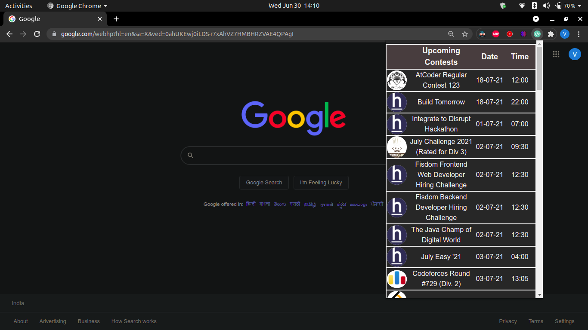

# Programming_Contest_Reminder
Chrome Extension developed using React Technology.
This extension would provide information about the following Sites
<ul>
<li> <a href="https://CodeForces.com" >CodeForces</a></li> 
<li> <a href="https://CodeChef.com" >CodeChef</a></li> 
<li> <a href="https://LeetCode.com" >LeetCode</a></li> 
<li> <a href="https://AtCoder.com" >AtCoder</a></li> 
<li> <a href="https://TopCoder.com" >TopCoder</a></li> 
<li> <a href="https://HackerRank.com" >HackerRank</a></li> 
<li> <a href="https://HackerEarth.com" >HackerEarth</a></li> 
<li> <a href="https://codingcompetitions.withgoogle.com/kickstart/" >Google Kick Start</a></li> 
</ul>
 
Here is an attached ScreenShot of The Extension Created.  

